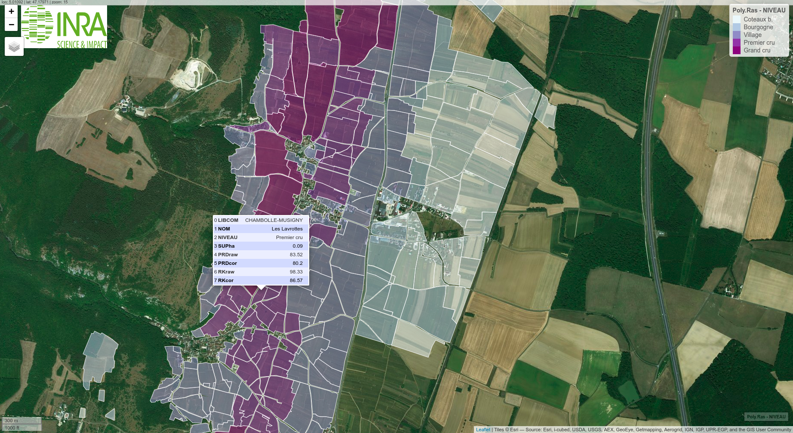

# Une classification statistique des vignes de la Côte d'Or

# English version

Modeling statistically the relationships between biophysical attributes of vineyards and the hierarchical scheme of *appellations d'origine contrôlée* allows to estimate a continuous quality score for each vineyard plot and to correct *commune* effects.

The research is described in the [AAWE working Paper XX](WorkingPaper.pdf) and the associated reproducibility file in [PDF](ReproPaper.pdf) and [Markdown](ReproPaper.md). Raw data are on the [INRA dataverse repo](https://www6.inra.fr/datapartage/) and the results are accessible through a [Shiny application](https://geoind-wine.firebaseapp.com).

# Version Française

La modélisation statistique des liens entre les attributs biophysiques des vignes et la hiérarchie des appellations d'origine contrôlées permet d'estimer un score continu de qualité pour chaque parcelle et de corriger les effets communaux.

Les détails de la construction des données, de l'estimation du modèle et de l'utilisation de l'application sont disponibles en versions [PDF](DataPaper.pdf) et [Markdown](DataPaper.md). Les données brutes sont accessibles sur [le serveur de l'INRA](https://www6.inra.fr/datapartage/) et les résultats sont consultables via [une application cartographique](https://geoind-wine.firebaseapp.com).

# Credits

Bug reports, comments and suggestions by opening an issue or [sending an email](mailto:jsay@inra.fr).

Made on `emacs` `org-mode` to juggle with `R`, `LaTex` and `Markdown`.

Special thanks to XX.

Licence GNU GPL V3, Copyright and licence notices must be preserved: <https://www.gnu.org/licenses/gpl-3.0.en.html>.
