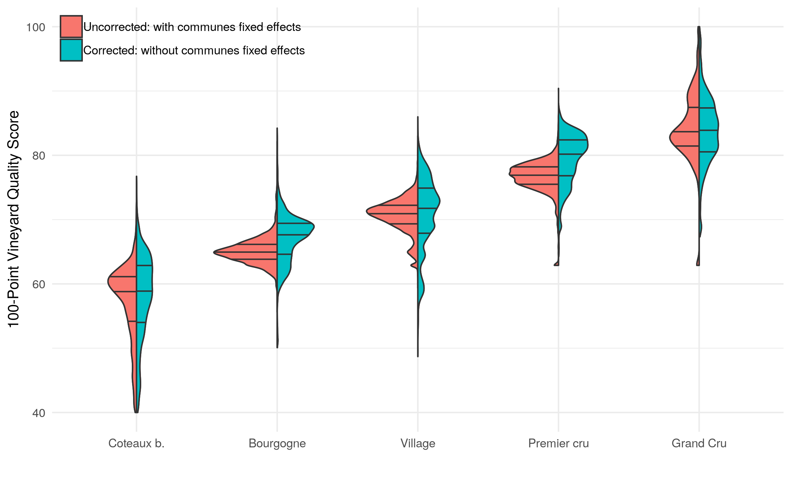

# The Informational Content of Geographical Indications

Predicting vineyard quality from econometric modeling of geographical indications in Côte d'Or (Burgundy, France)

Prédire la qualité du terroir à partir d'une modélisation économetrique des appellation d'origine en Côte d'Or (Bourgogne, France)

# English version

-   [Working paper](WorkingPaper.pdf)
-   Data: <https://www6.inra.fr/datapartage/>
-   Code: [PDF version](ReproPaper.pdf) or [Markdown](ReproPaper.md)
-   Dynamic carto: <https://geoind-wine.firebaseapp.com>

# Version Française

-   Présentation des données : [PDF version](DataPaper.pdf) or [Markdown](DataPaper.md)
-   Accéder aux données : <https://www6.inra.fr/datapartage/>
-   Cartographie dynamique : <https://geoind-wine.firebaseapp.com>

# Credits

Made on `emacs` `org-mode`, to interect with `R`, `LaTex`, `Markdown`.

 This work is licensed under a <a rel="license" href="http://creativecommons.org/licenses/by-nc-sa/4.0/">Creative Commons Attribution-NonCommercial-ShareAlike 4.0 International License</a>.
